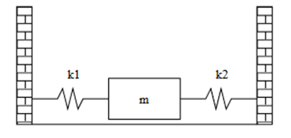

# Ejercicio 1 $\left( 5 \space puntos \right)$ #
La siguiente figura muestra una masa $m$ en reposo sobre una superficie sin rozamiento.

La masa está conectada a dos muros por muelles con constantes elásticas $k_1$ y $k_2$. El periodo de este sistema viene dado por la expresión

$$t = 2 \pi \sqrt \tfrac{m}{k_1 + k_2}$$

implementa una **función** llamado `muelles.m` que tenga como argumentos los valores de $m$, $k_1$, $k_2$ y que calcule y muestre el periodo $t$ por pantalla. La función **no retorna**, solo muestra. Evitar omitir punto y coma utilizar la función correspondiente para que muestre en pantalla el valor de $t$.

